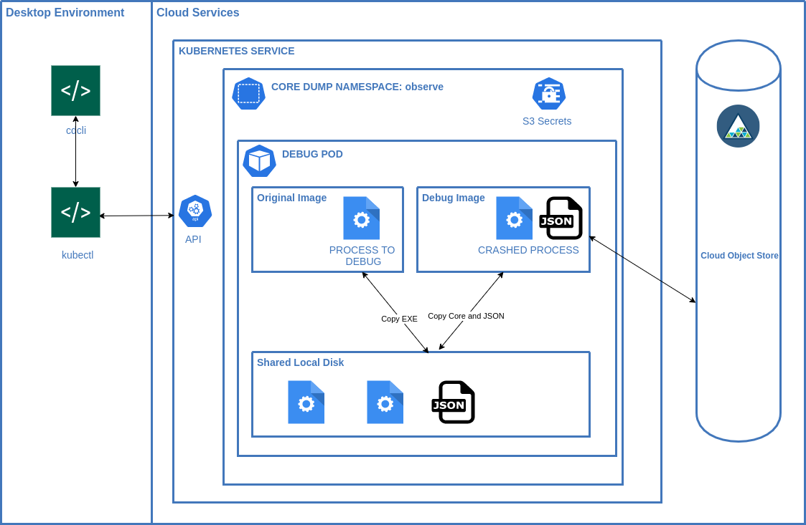

# core-dump-client

A cli with container definitions to enable debugging applications managed by https://github.com/IBM/core-dump-handler

## Code Of Conduct

We as members, contributors, and leaders pledge to make participation in our
community a harassment-free experience for everyone, regardless of age, body
size, visible or invisible disability, ethnicity, sex characteristics, gender
identity and expression, level of experience, education, socio-economic status,
nationality, personal appearance, race, religion, or sexual identity
and orientation.

We pledge to act and interact in ways that contribute to an open, welcoming,
diverse, inclusive, and healthy community.

[The full code of conduct is available here](./code-of-conduct.md)

## experimental

This tool is still under active development but the core functionality is in place. 
Currently it supports nodejs, java or default lldb tools. 

## prerequisites 

1. Ensure [core-dump-handler](https://github.com/IBM/core-dump-handler) is installed on your cluster.

2. Install the cli
    * Download the latest build from releases https://github.com/IBM/core-dump-client/releases
    Rename it cdcli and place it in a folder that is in your $PATH
    * Or build the client with `cargo install core-dump-client` in the core-dump-client folder.
    If you don't have rust installed you can get it with [rustup](https://rustup.rs)

3. Ensure your `kubectl` client is logged into the cluster
    kubectl install instructions are [available here](https://kubernetes.io/docs/tasks/tools/#kubectl)
   
## usage

Create a debug environment with 
```
cdcli -c [name-of-zipfile] -i [crashed-image-name]
```
e.g. 
```
cdcli 36c0d272-3295-4474-a16e-00885ba04fed-dump-1631477784-crashing-app-848dc79df4-srqkv-node-8-4.zip quay.io/number9/example-crashing-nodejs-app
```

This will log you into a running container with lldb tools and core file info available to you. 

To start a debug session in the environment run`rundebug.sh` command.

```
./rundebug
```

To inspect the metadata that was saved with crash `ls` will list the folder container your core file and the metadata json.

## demo

[](https://asciinema.org/a/438878)

### CLI Component Layout


## Build Status

### Default
[](https://quay.io/repository/icdh/default)
### Node.Js
[](https://quay.io/repository/icdh/nodejs)
### Java
[](https://quay.io/repository/icdh/java)